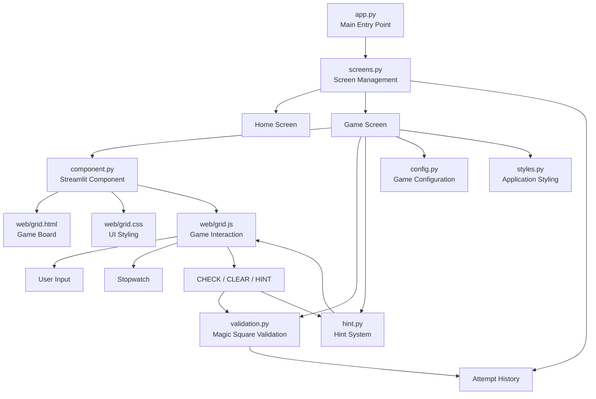

# Magic Square

An interactive **3 × 3 Magic Square Game** developed using Python and Streamlit.

The player has to fill a 3 × 3 grid using the numbers **1–9**, with each number used only once. The sum of every row, column, and diagonal must be **15**.

---

## 🚀 Live Demo

👉 [Play Magic Square](https://magicsquare-brainstorming-mathgame.streamlit.app/)

---

## 📌 Problem Statement

Develop an interactive Magic Square game that allows the user to construct a valid 3 × 3 Magic Square.

The game should:

- Use numbers from 1 to 9.
- Allow each number to be used only once.
- Ensure every row sums to 15.
- Ensure every column sums to 15.
- Ensure both diagonals sum to 15.
- Provide feedback when the solution is incorrect.
- Provide hints to help the player.
- Record the player's attempts and completion time.

---

## 🎯 Objectives

- To develop an interactive puzzle-based application.
- To implement Magic Square validation using Python.
- To provide a simple and user-friendly interface.
- To implement a stopwatch for tracking solving time.
- To provide a limited hint system.
- To maintain an attempt history.

---

## ⭐ Features

- 🧩 Interactive 3 × 3 Magic Square
- 🔢 Numbers 1–9 input
- ✅ Row, column, and diagonal validation
- 🎯 Target sum of 15
- ⏱️ Stopwatch
- 💡 3 hints per attempt
- ❌ Wrong attempt detection
- 🔄 Automatic restart after an incorrect attempt
- 📊 Attempt history
- 🏠 Home screen navigation
- 📖 How-to-play instructions
- 🎨 Custom HTML and CSS interface

---

## 🛠️ Technologies Used

- **Python** – Application logic
- **Streamlit** – User interface and application framework
- **HTML** – Game board structure
- **CSS** – Styling and visual design
- **JavaScript** – Interactive grid, timer, buttons, and component interaction
- **Streamlit Components V2** – Integration of the custom web component with Streamlit

---

## 📂 Project Structure

```text
Magic_Square/
│
├── app.py
├── screens.py
├── component.py
├── config.py
├── hint.py
├── validation.py
├── styles.py
├── requirements.txt
├── README.md
│
├── web/
│   ├── grid.html
│   ├── grid.css
│   └── grid.js
│
├── .gitignore
└── .gitattributes
```

---

## 🔄 Working Structure

The application follows a modular architecture where the Streamlit interface communicates with the game logic and custom web component.



### Application Flow

```text
User
  │
  ▼
Home Screen
  │
  │ START
  ▼
Game Screen
  │
  ├── Fill 3 × 3 Grid
  │
  ├── Stopwatch
  │
  ├── HINT
  │     └── hint.py
  │
  └── CHECK
        │
        ▼
   validation.py
        │
   ┌────┴────┐
   ▼         ▼
Valid      Invalid
   │         │
   ▼         ▼
Success    Restart
   │
   ▼
Attempt History
```

---

## 📄 File Description

| File | Purpose |
|------|---------|
| `app.py` | Main entry point of the application and handles screen navigation. |
| `screens.py` | Manages the Home, Game, and Attempt History screens. |
| `component.py` | Creates and connects the custom Streamlit web component. |
| `config.py` | Stores game configuration such as grid size, target sum, and number of hints. |
| `validation.py` | Validates the Magic Square according to the game rules. |
| `hint.py` | Provides the correct value for an empty cell when a hint is requested. |
| `styles.py` | Provides the application's custom styling. |
| `web/grid.html` | Defines the HTML structure of the interactive game board. |
| `web/grid.css` | Defines the styling of the game board and interface elements. |
| `web/grid.js` | Handles grid input, stopwatch, CHECK, CLEAR, HINT, and interaction with Streamlit. |
| `requirements.txt` | Contains the Python package required to run the application. |
| `README.md` | Contains the project documentation. |

---

## 🎮 How to Play

1. Open the application.
2. Click **START**.
3. Fill the 3 × 3 grid with numbers from **1–9**.
4. Use each number only once.
5. Make every row, column, and diagonal add up to **15**.
6. Use the **HINT** button if assistance is required.
7. Click **CHECK** to validate the solution.
8. If the solution is incorrect, the attempt is recorded and the game restarts.
9. A maximum of **3 hints** are available for each attempt.
10. Use **ATTEMPT HISTORY** to view previous attempts.

---

## ✅ Example of a Valid Magic Square

```text
8  1  6
3  5  7
4  9  2
```

### Row sums

```text
8 + 1 + 6 = 15
3 + 5 + 7 = 15
4 + 9 + 2 = 15
```

### Column sums

```text
8 + 3 + 4 = 15
1 + 5 + 9 = 15
6 + 7 + 2 = 15
```

### Diagonal sums

```text
8 + 5 + 2 = 15
6 + 5 + 4 = 15
```

Therefore, this is a valid 3 × 3 Magic Square.

---

## ▶️ How to Run the Project

### 1. Clone the repository

```bash
git clone <repository-link>
```

### 2. Open the project folder

```bash
cd Magic_Square
```

### 3. Install the required package

```bash
pip install -r requirements.txt
```

### 4. Run the Streamlit application

```bash
streamlit run app.py
```

The application will open in the browser.

---

## 🔍 Validation Logic

The solution is considered valid only when:

- All 9 cells contain numbers.
- Numbers are from 1 to 9.
- No number is repeated.
- Every row has a sum of 15.
- Every column has a sum of 15.
- Both diagonals have a sum of 15.

---

## 💡 Hint System

The game provides **3 hints per attempt**.

When a hint is requested:

1. The current grid is checked.
2. An empty cell is selected.
3. The correct number for that cell is provided.
4. The hinted number remains visible in the grid.
5. The number of available hints is reduced.

If an incorrect attempt causes the game to restart, the available hints are reset.

---

## 📊 Attempt History

The application records each CHECK attempt with:

- Attempt number
- Time taken
- Completion status

The user can view the recorded attempts through the **ATTEMPT HISTORY** option.

---

## 🚀 Future Enhancements

Possible future improvements include:

- Multiple difficulty levels
- Different Magic Square sizes
- Sound effects
- Improved animations
- Leaderboard
- Persistent database-based score storage
- User profiles and authentication

---

## 👩‍💻 Project

**Magic Square – Interactive 3 × 3 Puzzle Game**

Built using **Python, Streamlit, HTML, CSS, JavaScript, and Streamlit Components V2**.